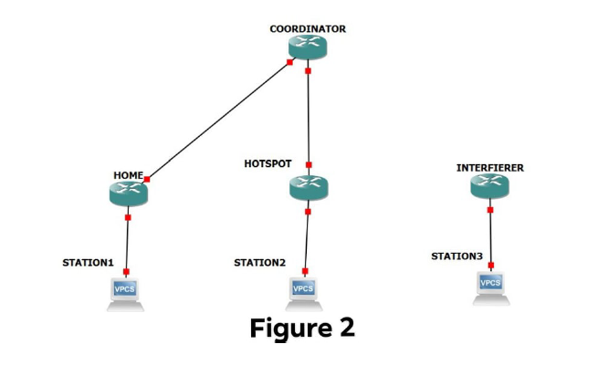
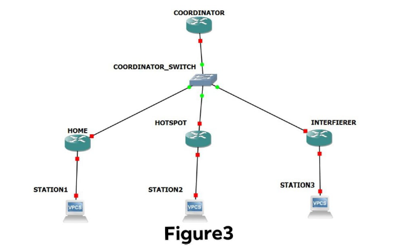


WiFi Slicer using Ath9k driver
===============

Project’s Purpose
---------------

The purpose of this project was to read and understand the code of the ath9k driver 
in order to alter it. These changes aimed to manipulate the channel
distribution between two or more links, giving priority to whichever link we
want at each particular time. The goal was to understand what part of the
driver was responsible for these changes, make it dynamic and add functionality 
to it in order to achieve the above purposes.

Implementation Overview
---------------

In order to change the distribution of the channel, we manipulated the priority
of each link on the channel by changing the back off in the AP of each link
through AIFS parameter. For the implementation of the project we used 5
nodes of the NITOS testbed for the first experiment and 7 for the second. Each
had a different purpose. Firstly, we used one as an outside COORDINATOR to
dynamically change the priority of the other two links using configured beacon
packets. The topology of the other nodes is depicted in 
the following pictures(Figures 1,2,3),showing the APs and their respective STAs:

  
  
  

The files in which we added functionality are the below:

**COORDINATOR**
- net/mac80211/tx.c

**AP**
- drivers/net/wireless/ath/ath9k/main.c
- drivers/net/wireless/ath/ath9k/mac.c
- drivers/net/wireless/ath/ath9k/mac.h

To test the above functionality we experiment using the iperf tool.

Steps to Final Implementation
---------------

For the AP part, we searched for AIFS parameter and where it can be changed
dynamically. We tried using net/mac80211/util.c , but the dynamic approach
was not successful. So we tried finding the solution in the ath9k directory. We
determined that the change should be in a function that is constantly invoked,
so we ended up using ath9k\_hw\_resettxqueue on mac.c adding one argument
and renaming ath9k\_hw\_resettxqueue\_helper, which we call from xmit.c in
function ath\_txq\_update.

For the COORDINATOR part, we tried to change the beacon packet by
adding a Vendor Specific Type of an Information Element. We tried using
the hostapd.conf file but the dynamic approach was not possible through that
method. So we found the net/mac80211/tx.c, which is responsible for the
packet transmission. There we added code so as to change the beacon packet,
enabling it to send the appropriate information for each of our experiments
(\_\_ieee80211\_beacon\_get()).

The final step of our research was to transfer internally the information that
the AP received from beacon packets, regarding its new AIFS, to the driver.
This functionality was achieved through a custom made program that receives
and decodes beacon packets to obtain the AIFS values that were meant for it
,configures a proc file and writes in it the new AIFS value ,which is then read
by the ath9k driver so as to change the AIFS value of its link.. All of these are
implemented in a C program file called manip.c . It uses tcpdump to listen on
the channel and hexdump to convert it in hexadecimal. Then it searches the
file to find the beacon and each respective information, before writing it on the
proc file.

Experiments/Scenarios
---------------

The first scenario we had to implement was a simple channel distribution be-
tween our two links. The SSID of the primary AP is HOME and of the secondary
is HOTSPOT as is shown in the above picture. The goal of this scenario is to
periodically change the priority of each link. We start with the maximum pri-
ority(100%) given to HOME and the minimum(0%) given to HOTSPOT. Then
we start changing that priority every 10 seconds, gradually giving HOTSPOT
more while taking it away from HOME. The rate of this change is 10% every
10 seconds. The experiment becomes stabilized 100 seconds after the initializa-
tion of the COORDINATOR, when the priority of the channel is 0% HOME –
100% HOTSPOT. For this scenario we added code to the COORDINATOR’s
net/mac80211/tx.c . The topology of this scenario is shown in Figure 1.

For the second scenario we had to implement two different sub-scenarios:

1. The goal of this sub-scenario is to add one more link to the experiment.
This new one has SSID = INTERFIERER. This scenario starts with HOME
and HOTSPOT sharing the channel equally for 30 seconds. After these 30 sec-
onds the third link connects to this channel and, without anyone determining
the priorities, each has 33.3% of the channel. The only two links that the 
COORDINATOR can control is HOME and HOTSPOT. What we do now is have
the COORDIATOR listen to the channel and determine the existence of a third
link with the goal of giving priority to HOME, while taking it from HOTSPOT
and without having any control over INTERFIERER. On the COORDINATOR
node runs a program similar to manip.c, called coord\_listen.c, that listens to
the channel and determines the existance of the third link. If the link exists the
program writes on a proc file the integer 1, otherwise it writes the integer 0.
Then net/mac80211/tx.c, which is responsible for sending the modified beacon
packets, reads this proc file and in case of existence it changes the priority on
the channel by changing the information on the beacon . So what we do is take
the HOTSPOT off the air with AIFS = 255 and give priority to HOME, with
AIFS = 1, over INTERFIERER which has the default AIFS = 2.

2. The goal of this second scenario is to add INTERFIERER to the list of
links that the COORDINATOR has power over, at the time of its appearance.
In this scenario after the 30 seconds that pass with HOME and HOTSPOT
alone in the channel, INTERFIERER connects and the new priorities on the
channel are 66% HOME and 33% INTERFIERER, while HOTSPOT has 0%.To
achieve that the AIFS values we use are 2 for HOME and 6 for INTERFIERER.
Of course HOTSPOT has AIFS value 255 . We still use coord\_listen.c to de-
termine the existence of the INTERFIERER.
